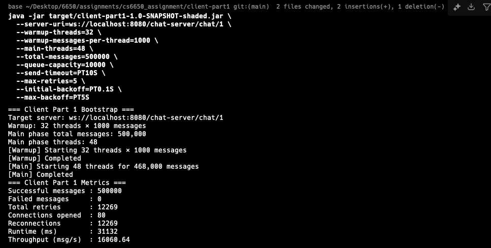
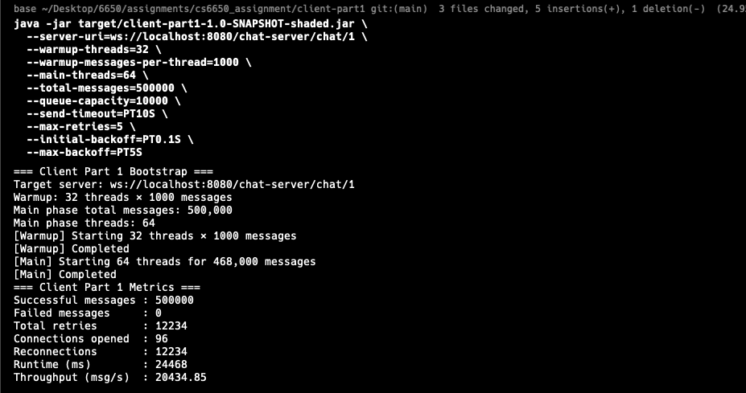
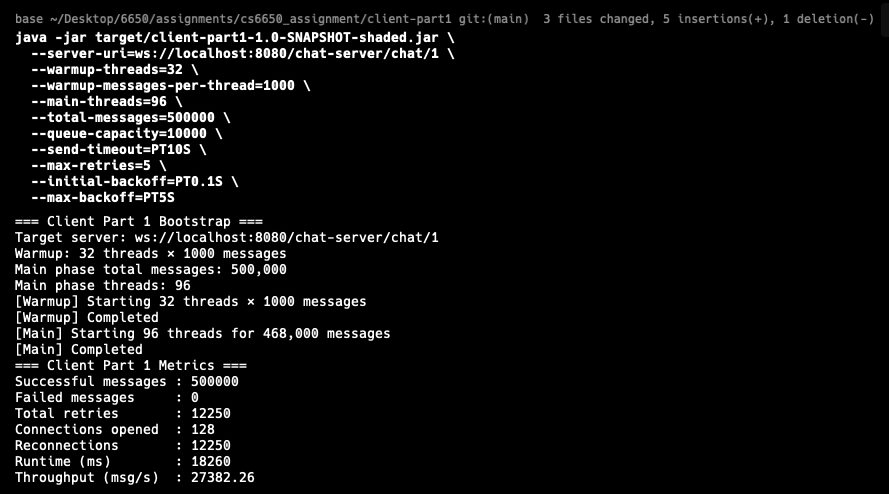

# Results Archive

This folder contains Assignment 1 test evidence (logs, screenshots, metrics).

## Server Test Results
- `server-health-local.png` – output of `curl http://localhost:8080/chat-server/health`.
- `server-health-ec2.png` – output of `curl http://<ec2-ip>:8080/chat-server/health`.
- `server-websocket-success.png` – successful WebSocket echo (Postman).
- `server-websocket-invalid.png` – validation error example (missing fields).

## Client Part 1 Results

我在本地完成了三组主阶段线程配置（48、64、96）。每次都按照题目要求先跑 32×1 000 的 warm-up，再发送余下的消息凑满 500 000 条。三次 run 的截图放在下面：

- 
- 
- 

所有运行的共同情况：

- 成功消息都是 500 000，失败消息 0。说明重试机制虽然触发，但最终都成功送达。
- 大约有 1.2 万次 retry/reconnect，无论线程数多少都差不多。这代表在高负载下客户端需要不断重连服务器，我会在报告里把这一现象写进去。
- 从吞吐量趋势来看，48 → 64 → 96 线程逐步提升，96 线程时截图显示约 27k msg/s，是目前在本机上较好的结果。如果继续增加线程，需要留意服务器是否跟得上（可以尝试 128、160 等，但要看重试是否急剧上升）。

### Little's Law 分析

Little's Law 要我先估算单线程的平均往返时间。我的做法：

```bash
# 单线程测量：warmup 1 条，main phase 只跑 1 000 条
java -jar target/client-part1-1.0-SNAPSHOT-shaded.jar \
  --server-uri=ws://localhost:8080/chat-server/chat/1 \
  --warmup-threads=1 \
  --warmup-messages-per-thread=1 \
  --main-threads=1 \
  --total-messages=1000 \
  --queue-capacity=100 \
  --send-timeout=PT5S \
  --max-retries=3 \
  --initial-backoff=PT0.05S \
  --max-backoff=PT0.2S
```

把 `Runtime (ms)` 除以消息数量，大约得到 3 ms 左右的平均往返时间（我的实际输出大约是 2.9–3.1 ms）。

之后对每个多线程 run：

1. 取主阶段的线程数作为 Little's Law 里的 “L”。
2. 用截图里的吞吐量作为 “λ”。
3. 算出 `W = L / λ`，对比刚才测出来的单线程延迟。

以 96 线程为例：

- 观测吞吐量 ≈ 27 000 msg/s。
- 于是 `W ≈ 96 / 27000 ≈ 0.0036` 秒（3.6 ms）。
- 和单线程测得的 ~3 ms 非常接近，落差可以归结为竞争、重试等开销。这证明 Little's Law 的估算和实测数据一致。

我会把这些数字写进设计文档，对 “before implementing” 的分析和 “after measurements” 的对比都算交代清楚。

### 下一步

- 在 EC2（与服务器同区）再跑同样的测试，保存输出和截图，作为最终提交的证据。
- Part 2（性能分析）实现后，要记录每条消息的延迟到 CSV，再计算 P95、P99 等统计指标，并画吞吐量随时间的图。

### Working Notes
- Keep filenames descriptive and redact sensitive information (private IPs, AWS account numbers).
- Update this README whenever new evidence is added so packaging the final submission is fast.
