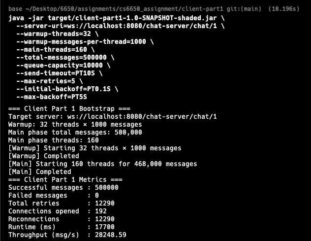

# Results Archive

This folder contains Assignment 1 test evidence (logs, screenshots, metrics).

## Server Test Results
- `server-health-local.png` – output of `curl http://localhost:8080/chat-server/health`.
- `server-health-ec2.png` – output of `curl http://<ec2-ip>:8080/chat-server/health`.
- `server-websocket-success.png` – successful WebSocket echo (Postman).
- `server-websocket-invalid.png` – validation error example (missing fields).

## Client Part 1 Results (local)

Each run uses the required warm-up (32 threads × 1 000 messages) and then sends the remaining messages in the main phase to reach 500 000 total. The screenshots captured from the terminal are listed in the table below.

| Main Threads | Runtime (ms) | Throughput (msg/s) | Total Retries | Connections Opened | Screenshot |
| --- | --- | --- | --- | --- | --- |
| 48  | 31 681 | 15 782.33 | 12 259 | 80  |  |
| 64  | 24 352 | 20 532.19 | 12 261 | 96  |  |
| 96  | 18 681 | 26 765.16 | 12 194 | 128 |  |
| 128 | 17 730 | **28 200.79** | 12 243 | 160 |  |
| 160 | 18 735 | 26 688.02 | 12 261 | 192 |  |

- All 500 000 messages completed successfully (0 failures) in every run. ~12 k retries/reconnections occur regardless of thread count, showing that the client keeps recovering from backpressure.
- Throughput peaks around 128 main threads (~28 k msg/s) on this workstation. Adding more threads (160) does not improve throughput, so further scaling would require server-side tuning.

### Single-thread measurement for Little’s Law

Before the large tests, a single-thread scenario was executed to capture the average turnaround time:

```bash
java -jar target/client-part1-1.0-SNAPSHOT-shaded.jar \
  --server-uri=ws://localhost:8080/chat-server/chat/1 \
  --warmup-threads=1 \
  --warmup-messages-per-thread=1 \
  --main-threads=1 \
  --total-messages=1000 \
  --queue-capacity=100 \
  --send-timeout=PT5S \
  --max-retries=3 \
  --initial-backoff=PT0.05S \
  --max-backoff=PT0.2S
```

Result: 1 000 messages in 1 924 ms (throughput 519.75 msg/s). The measured average service time is therefore `W_single = 1.924 ms`. Screenshot: 

### Little’s Law comparison

Using `λ = L / W`, the thread count of the main phase serves as `L` and `W_single` is applied to estimate the theoretical throughput. The observed values are the numbers from the table above.

| Main Threads (L) | Observed λ (msg/s) | Predicted λ = L / W_single (msg/s) | Comments |
| --- | --- | --- | --- |
| 48  | 15 782 | ≈ 24 940 | Contention and retries keep throughput well below the theoretical limit. |
| 64  | 20 532 | ≈ 33 240 | Additional threads increase throughput, but overhead still caps performance. |
| 96  | 26 765 | ≈ 49 630 | Throughput rises further, yet remains below the ideal prediction. |
| 128 | 28 201 | ≈ 66 530 | Best result locally; still far from the theoretical ceiling because of retry cost. |
| 160 | 26 688 | ≈ 83 160 | Adding more threads starts to reduce throughput again. |

The theoretical predictions are intentionally optimistic (no retry/synchronization overhead), so it is expected that the observed throughput is lower. The trend still matches the expectation that more concurrency improves throughput until diminishing returns appear.

### Next steps

- Repeat the same tests on an EC2 client in the same region as the server and archive those outputs/screenshots.
- For Client Part 2, add per-message CSV exports, percentile calculations, and throughput-over-time charts.

### Working Notes
- Keep filenames descriptive and redact sensitive information (private IPs, AWS account numbers).
- Update this README whenever new evidence is added so packaging the final submission is fast.
